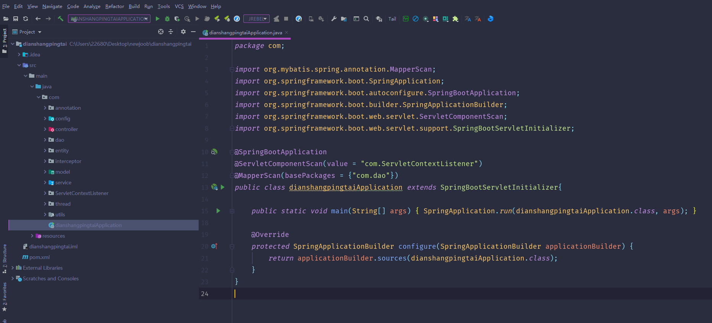
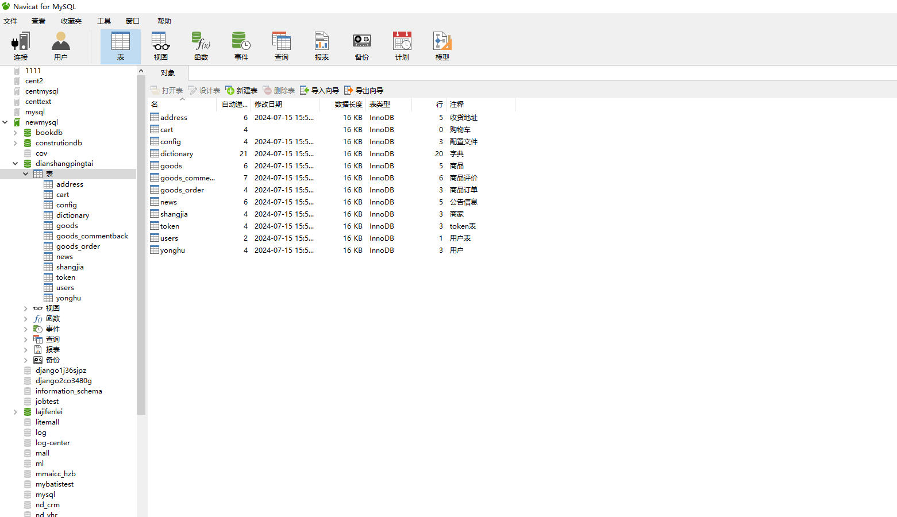
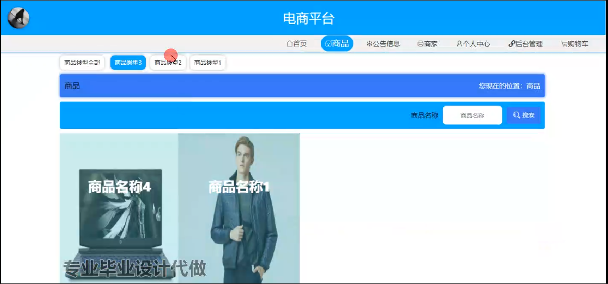
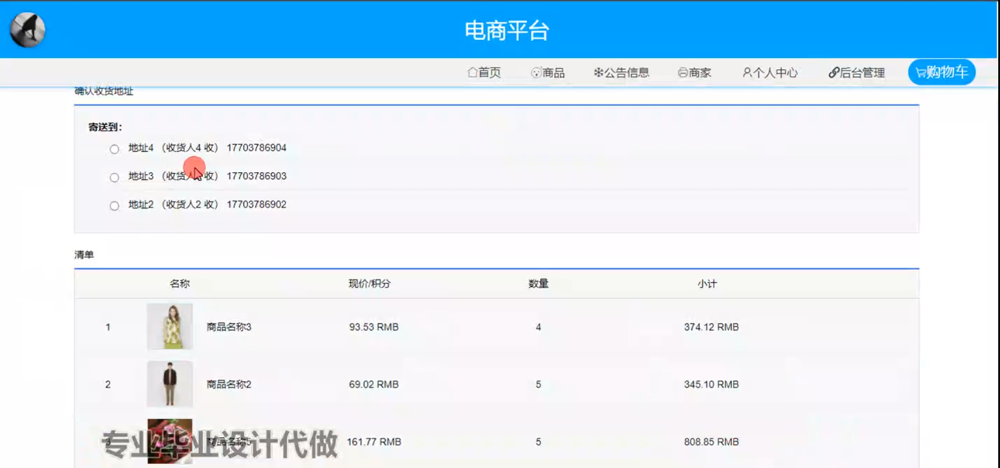
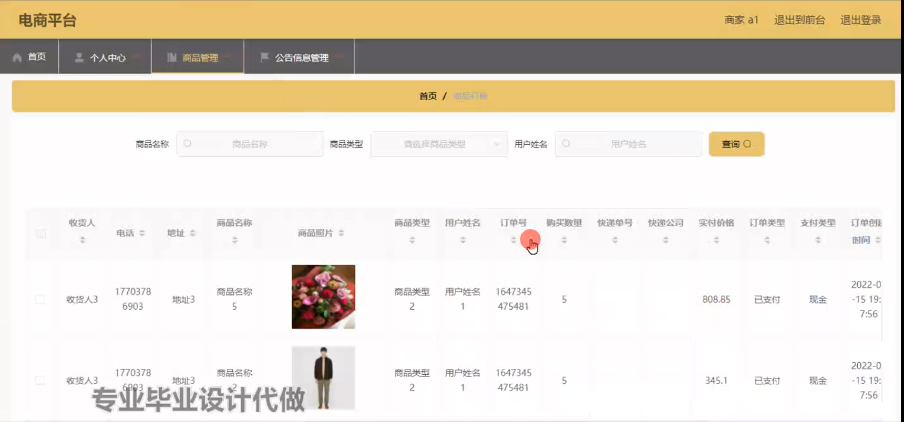
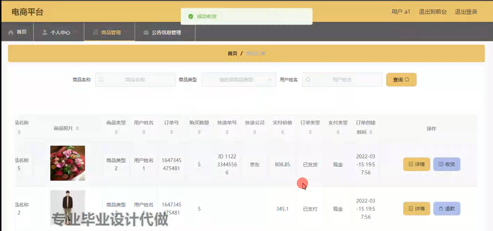
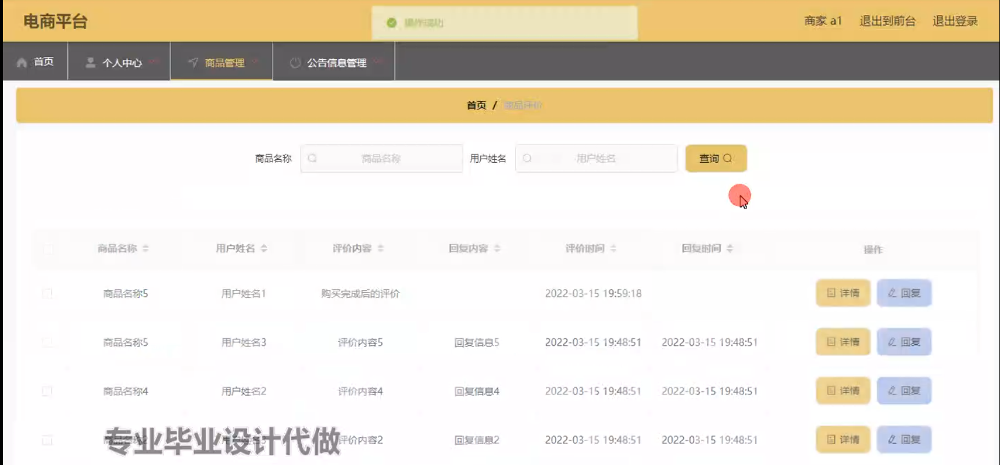
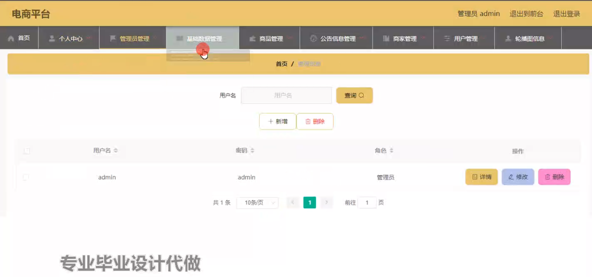
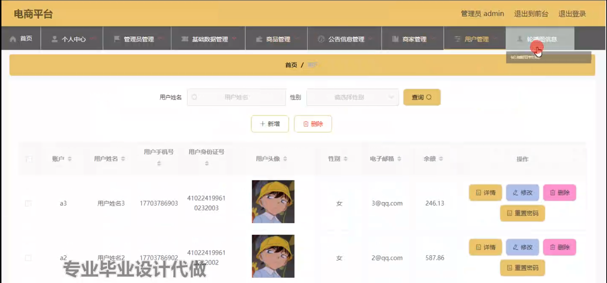
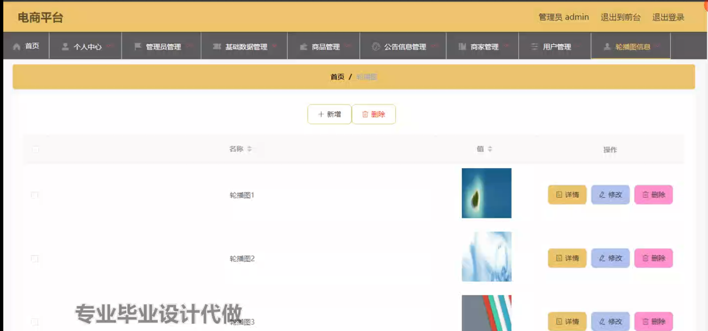

# 基于SpringBoot电商平台

#### 介绍

随着互联网的飞速发展，电子商务已经成为人们日常生活中不可或缺的一部分。然而，当前的电商市场竞争激烈，用户需求日益多样化和个性化，传统的电商模式面临着诸多挑战，如管理效率低下、用户体验不佳、商家服务质量参差不齐等。
本基于 Spring Boot 的电商平台旨在打造一个高效、便捷、智能的购物环境，整合管理端、商家端和用户端的功能，实现电商业务的全流程管理和优化，为用户提供优质的购物体验，为商家提供强大的销售渠道和管理工具。

#### 技术栈

后端技术栈：Springboot+Mysql+Maven

前端技术栈：Vue+Html+Css+Javascript+ElementUI

开发工具：Idea+Vscode+Navicate

#### 系统功能介绍

（一）管理端  
个人中心：管理端人员可在个人中心查看和修改自己的个人信息，接收系统通知等。  
管理员管理：对不同级别的管理员进行权限分配和管理，确保管理工作的有序进行。  
基础数据管理：  
商品分类管理：对商品进行详细分类，如电子产品、服装、家居用品等，方便用户查找和浏览。  
地区管理：设置不同的配送地区和运费规则。  
支付方式管理：整合多种支付渠道，如在线支付、货到付款等。  
商品管理：  
商品审核：对商家上架的商品进行审核，确保商品信息的真实性和合法性。  
商品上下架管理：根据市场需求和商品销售情况，对商品进行上下架操作。  
商品库存管理：实时监控商品库存数量，及时提醒商家补货。  
公告信息管理：发布平台的各类公告，如促销活动、系统维护通知等。  
商家管理：  
商家入驻审核：对申请入驻的商家进行资质审核和背景调查。  
商家违规处理：对违反平台规则的商家进行警告、处罚或封禁等操作。  
用户管理：管理用户的注册信息、消费记录、投诉反馈等。  
轮播图信息：设置平台首页的轮播图，展示热门商品、促销活动等重要信息。  

（二）商家端  
商品：  
商品上架：商家可以上传商品图片、填写商品详情、设置价格和库存等信息。  
商品编辑：对已上架的商品进行信息修改和优化。  
商品库存管理：实时查看商品库存，及时调整库存数量。  
公告信息：查看平台发布的公告，了解平台政策和活动信息。  
商家：设置店铺信息，如店铺名称、简介、联系方式等。  
个人中心：修改个人资料、密码等。  
后台管理  
商品管理：对商品的销售数据进行分析，了解商品的受欢迎程度和销售趋势。  
公告信息管理：发布店铺自己的促销活动、新品上架等公告。    
购物车：查看用户添加到购物车中的自家商品。  

（三）用户端  
商品：  
商品浏览：用户可以按照分类、关键词等方式搜索和浏览商品。  
商品详情查看：查看商品的图片、描述、规格、用户评价等详细信息。  
商品收藏：对感兴趣的商品进行收藏，方便后续购买。  
公告信息：及时了解平台的最新活动、优惠政策等。  
商家：查看商家的信誉、评价等信息，选择可靠的商家进行购物。  
个人中心：管理个人收货地址、订单记录、优惠券等。  
后台管理  
商品管理：查看自己购买过的商品记录和评价。  
公告信息管理：关注感兴趣的公告。  
购物车：将心仪的商品添加到购物车，进行结算操作。  

#### 系统作用

提升购物体验  
为用户提供便捷的购物流程、丰富的商品选择和个性化的推荐服务。  

促进商家发展  
为商家提供高效的销售渠道、精准的营销工具和完善的店铺管理功能。  

提高管理效率  
使管理端能够实现对平台的全面监控和有效管理，保障平台的正常运营和持续发展。  

推动电商行业创新  
不断优化和完善功能，适应市场变化和用户需求，为电商行业的发展注入新的活力。

#### 系统功能截图

代码结构

数据库表

登录

前台页面首页

商品模块

个人中心

购物车

商家端后台管理

公告相信管理

商品管理

管理员管理

用户管理

轮播信息管理

#### 总结

基于 Spring Boot 的电商平台在满足用户购物需求和商家销售需求方面发挥了重要作用。然而，该系统仍存在一些不足之处，例如在应对高并发访问时的性能优化还有提升空间，对于商品推荐算法的精准度还需进一步提高，以及在保障用户隐私和数据安全方面需要持续加强。未来，我们将不断改进和完善系统，加强技术创新和服务优化，以适应电商行业快速发展的需求，为用户和商家创造更大的价值。

#### 使用说明

创建数据库，执行数据库脚本 修改jdbc数据库连接参数 下载安装maven依赖jar 启动idea中的springboot项目

前台登录页面
http://localhost:8080/dianshangpingtai/front/index.html

后台登录页面
http://localhost:8080/dianshangpingtai/admin/dist/index.html

管理员				账户:admin 		密码：admin

商家				账户:a1 		密码：123456

用户				账户:a1 		密码：123456